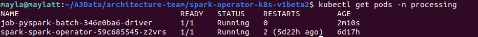
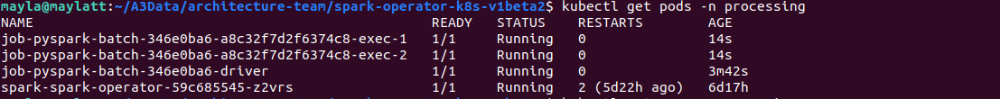
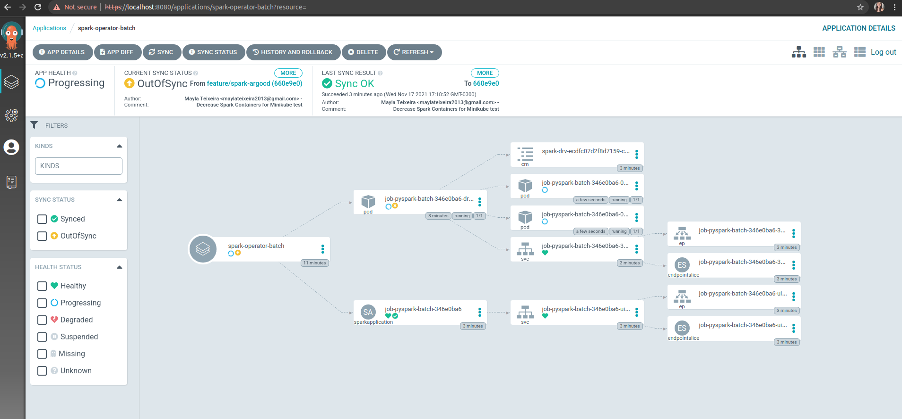
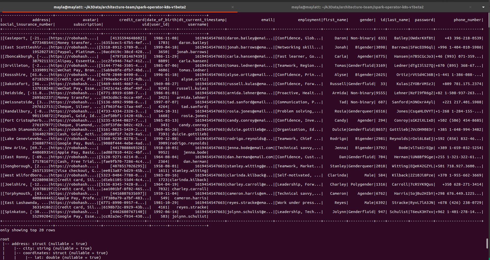
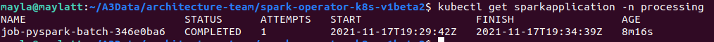

<p align="center">
  <a href="" rel="noopener">
 </a>
</p>

The Kubernetes Operator for Apache Spark aims to make specifying and running [Spark](https://github.com/apache/spark) applications as easy and idiomatic as running other workloads on Kubernetes. It uses
[Kubernetes custom resources](https://kubernetes.io/docs/concepts/extend-kubernetes/api-extension/custom-resources/)
for specifying, running, and surfacing status of Spark applications. For a complete reference of the custom resource definitions, please refer to the [API Definition](docs/api-docs.md). For details on its design, please refer to the [design doc](docs/design.md). It requires Spark 2.3 and above that supports Kubernetes as a native scheduler backend.

The Kubernetes Operator for Apache Spark currently supports the following list of features:

* Supports Spark 2.3 and up.
* Enables declarative application specification and management of applications through custom resources.
* Automatically runs `spark-submit` on behalf of users for each `SparkApplication` eligible for submission.
* Provides native [cron](https://en.wikipedia.org/wiki/Cron) support for running scheduled applications.
* Supports customization of Spark pods beyond what Spark natively is able to do through the mutating admission webhook, e.g., mounting ConfigMaps and volumes, and setting pod affinity/anti-affinity.
* Supports automatic application re-submission for updated `SparkApplication` objects with updated specification.
* Supports automatic application restart with a configurable restart policy.
* Supports automatic retries of failed submissions with optional linear back-off.
* Supports mounting local Hadoop configuration as a Kubernetes ConfigMap automatically via `sparkctl`.
* Supports automatically staging local application dependencies to Google Cloud Storage (GCS) via `sparkctl`.
* Supports collecting and exporting application-level metrics and driver/executor metrics to Prometheus.


<h3 align="center"> Spark Operator k8s</h3>

<div align="center">

[]()
[](/LICENSE)

</div>

---

## 📝 Table of Contents

- [About](#about)
- [Architeture](#architeture)
- [Usage](#usage)
- [Authors](#authors)

## 🧐 About <a name = "about"></a>

Apache Spark, usually known as the successor of MapReduce, is a framework for parallel distributed data processing, being capable of executing concurrent Jobs (with support for the programming languages: Python, Java, Scala, SQL and R) to easily process huge amounts of data, with resilience, speed and scalability. Spark is used mostly for batch processing use cases (bounded data such as ETL jobs, analytics, data integration, etc.), but it also provides support for streaming use cases (unbounded data, like consuming messages from an Apache Kafka topic to train a ML model, performing streaming ETL, etc.).

## 🔧 Architeture k8s Spark <a name = "architeture"></a>


### Prerequisites

```
Spark: 3.1.1 https://spark.apache.org/downloads.html

Docker: 20.10.7 https://docs.docker.com/engine/install/

Aws-cli: 2.2.1 https://docs.aws.amazon.com/cli/latest/userguide/cli-chap-install.html
```

## 🎈 Usage <a name="usage"></a>

1. Create repository on ECR (Elastic Container Registry)
    ```sh
    aws ecr create-repository \
    --repository-name <repository-name> \
    --image-scanning-configuration scanOnPush=true \
    --region us-east-1
    ```  
2. Authenticate to ECR
    ```sh
    aws ecr get-login-password --region us-east-1 | docker login --username AWS --password-stdin 127012818163.dkr.ecr.us-east-1.amazonaws.com
    ```
3. Build spark operator
    ```sh
    docker build -t spark-operator-<namespace> .
    ```
4. Tag image spark operator
    ```sh
    docker tag spark-operator-<namespace>:latest 127012818163.dkr.ecr.us-east-1.amazonaws.com/spark-operator-<namespace>:latest
    ```
5. Push image from the repository ECR
    ```sh
    docker push 127012818163.dkr.ecr.us-east-1.amazonaws.com/spark-operator-<namespace>:latest
    ```

## Config on Cluster [k8sa3sandbox]

1. Create namespace
    ```sh
    kubectl create namespace <namespace>
    ```
2. Create serviceaccount from namespace
    ```sh
    kubectl create serviceaccount spark -n <namespace>
    ```
3. Create Cluster Role Binding
    ```sh
    kubectl create clusterrolebinding spark-role --clusterrole=edit --serviceaccount=<namespace>:spark --namespace=<namespace>
    ```
4. Create Secret with AWS Credential
    ```sh
    kubectl create secret -n <namespace> generic aws-secret \
    --from-literal=keyid=<AWS_ACCESS_KEY_ID> \
    --from-literal=keysecret=<AWS_SECRET_ACCESS_KEY>
    ```

5. Add Helm
    ```sh
    helm repo add spark-operator https://googlecloudplatform.github.io/spark-on-k8s-operator
    helm repo update
    helm install spark spark-operator/spark-operator --namespace <namespace>
    helm ls -n <namespace>
    ```
    
## Deploy Spark Application using ArgoCD
1. Add Repository, ignoring the server's host key.
    ```sh
    argocd repo add git@github.com:A3Data/architecture-team.git \
    --ssh-private-key-path <path-to-private-ssh-key> \
    --insecure-skip-server-verification
    ```
2. Create Application. Note that in this example the path has been defined for the Delta Lake Application.
    ```sh
    argocd app create <app-name> \
    --port-forward-namespace <argocd-namespace> \
    --repo git@github.com:A3Data/architecture-team.git \
    --revision <repo-branch> \
    --path spark-operator-k8s-v1beta2/repository/kubernetes/pyspark/deltalake/ \
    --dest-server https://kubernetes.default.svc \
    --dest-namespace <namespace> \
    ```
3. Sync Application
    ```sh
    argocd app sync <app-name> --prune
    ```


    
## Expected Result
1. Cluster State ```kubectl get pods -n <namespace>```



2. Executors State



3. ArgoCD UI



4. Logs Spark Operator Driver



5. Cluster State Finished



## ✍️ Authors <a name = "authors"></a>

- [@carlosbpy](https://github.com/carlosbpy) - Idea & Initial work
